# CustomNPC+ DBC Addon

**CustomNPC+ DBC Addon** is a Minecraft 1.7.10 Forge mod that bridges [CustomNPC+](https://github.com/KAMKEEL/CustomNPC-Plus) and [Dragon Block C](https://www.curseforge.com/minecraft/mc-mods/dragon-block-c), adding full DBC combat integration, custom transformations, ki-based abilities, a dynamic overlay system, and deep NPC customization for the DBC universe.

> This mod is an **addon** to CustomNPC+. It requires **CustomNPC+**, **Dragon Block C**, **JRMCore**, **JBRAClient**, and a mixin loader like **UniMixins**.

---

<a href="https://discord.gg/pQqRTvFeJ5">  </a>
<a href="https://ko-fi.com/kamkeel">  </a>

[](https://modrinth.com/mod/customnpc-plus)
[](https://www.curseforge.com/minecraft/mc-mods/moreplayermodels-plus)

---

### Downloads

- **Modrinth**: [Download](https://modrinth.com/mod/customnpc-plus-dbc-addon)
- **CurseForge**: [Download](https://www.curseforge.com/minecraft/mc-mods/cnpc-dbc-addon)

### Installation

Drop the DBC Addon jar into your mods folder alongside **CustomNPC+**, **Dragon Block C**, **JRMCore**, **JBRAClient**, and **UniMixins**. The addon hooks into both mods automatically via mixins.

> Please **backup your world** before installing. Report any bugs on the [issue tracker](https://github.com/KAMKEEL/CustomNPC-DBC-Addon/issues).

---

## Feature Overview

### Custom Forms

A complete transformation system for creating custom DBC forms with stat multipliers, visual customization, mastery progression, and stacking.

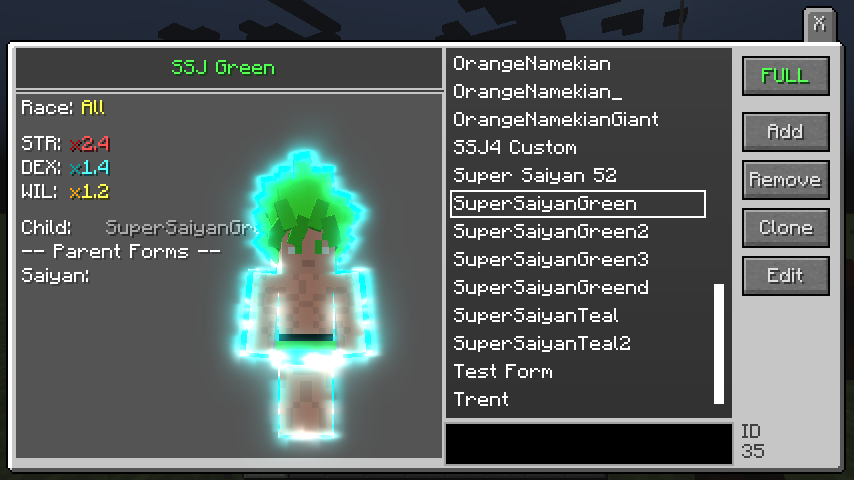

- **Stat Multipliers** - Configure STR, DEX, and WIL multipliers per form with mind level requirements
- **Race Targeting** - Restrict forms to specific DBC races or allow all
- **Parent/Child Chains** - Build transformation trees where forms require a parent form to be active
- **Ascend/Descend Sounds** - Custom sound events for transforming and powering down
- **Tags** - Organize forms with UUID-based tags for filtering and scripting

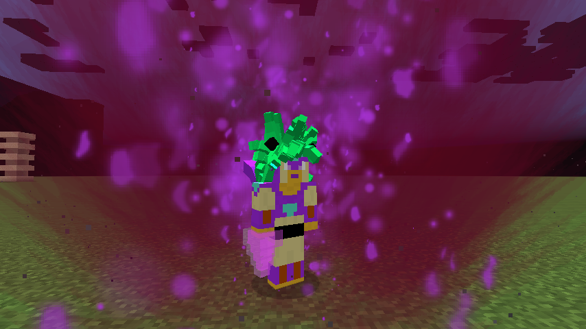

---

### Form Display

Every form controls exactly how the character looks while transformed.

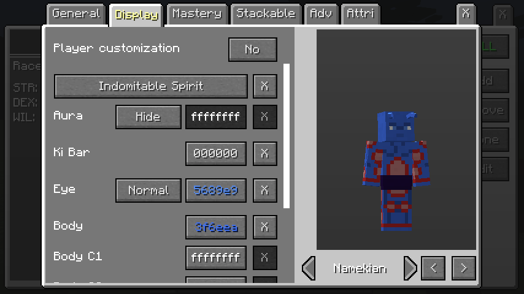

- **Hair** - Override hair type, color, and color source per form
- **Eye Color** - Custom eye colors for each transformation
- **Body Colors** - Configure body, C1, C2, and C3 colors for Arcosian forms
- **Fur Color** - Fur tinting for SSJ4, Oozaru, and other fur-based forms
- **Aura** - Assign a custom aura and aura color to each form
- **Overlay Control** - Enable or disable specific overlay types per form
- **Gender & Age** - Forms respect gender and age model differences
- **Player Customization** - Optionally allow players to customize form appearance

---

### Form Mastery

Forms support a **heat and pain system** that rewards players for training their transformations.

- **Heat** - Builds while a form is active. Configure time to max heat and multipliers that decrease with mastery level, so mastered forms generate no heat
- **Pain** - When a player descends with enough accumulated heat, they enter a pain state. Configure pain duration, heat threshold (0-100%), and multipliers that scale down with mastery
- **Per-Level Scaling** - Both heat and pain multipliers reduce at a configurable rate per mastery level

---

### Form Stacking

Custom forms can **stack with vanilla DBC transformations** and with each other.

**Vanilla Stacking** - Stack with Kaioken (configurable levels/multipliers), Ultra Instinct, God of Destruction, Mystic, Legendary, Divine, and Majin. Override default multipliers when stacking.

**Custom Stacking** - Link up to **4 custom stacking pairs** per form, connecting a source form to a target form. Circular dependencies and parent/child conflicts are automatically prevented.

---

### Custom Auras

Create and assign custom auras with deep visual control.

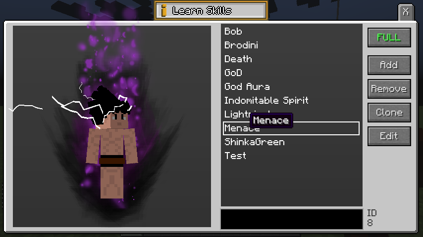

- **2D Aura Types** - Simple, Ring, Ripple, Spiral, Halo, Matrix, Grid
- **3D Aura Types** - Simple, Ring, Ripple, Spiral, Halo, Vortex, Shimmer
- **Dynamic Colors** - Pull colors from eye, hair, fur, or body color sources, or set custom colors with glow/emissive rendering
- **Particle Effects** - Configurable particle generation with rendering parameters
- **Scale & Opacity** - Full control over aura size, transparency, and animation speed
- **Sound** - Auras can play looping sound effects

---

### Custom Outlines

Character outline rendering for visual flair.

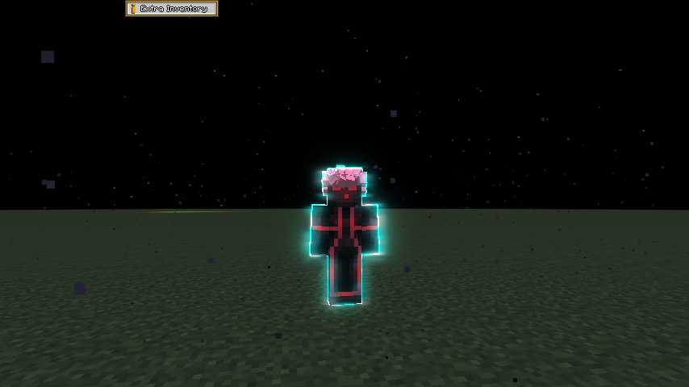

- **Per-NPC Colors** - Set unique outline colors per NPC or player
- **Conditional Rendering** - Toggle outlines based on form or custom conditions
- **Bloom & Glow** - Integrates with the shader pipeline for glowing outlines

---

### Overlay System

A dynamic overlay pipeline for rendering textures on specific face and body parts, completely independent from CNPC+'s skin overlay system.

- **Overlay Chains** - Named groups of overlays with conditional rendering (form state, race, gender), face part control, and individual enable/disable
- **Body Part Targeting** - Target Face, Eyebrows, Eye Whites, Left/Right Eye, Nose, Mouth, Chest, Arms, Legs, or ALL
- **Dynamic Colors** - Custom, Eye, Hair, Fur, Body (CM/C1/C2/C3) color sources with emissive glow
- **Overlay Scripts** - Janino-compiled scripts for dynamic textures and colors with full context access (race, gender, age, body type, form, colors)

**Built-in Overlays:** Pupils (all races/genders), SSJ3 Face, SSJ4 Face (with Daima variant), SSJ4 Fur (with Legend variant), Oozaru Fur, Savior from Heaven, Black Frieza (3 body types), Namekian textures, Berserk Eyes

---

### DBC NPC Models

NPCs can be configured with full DBC character customization.

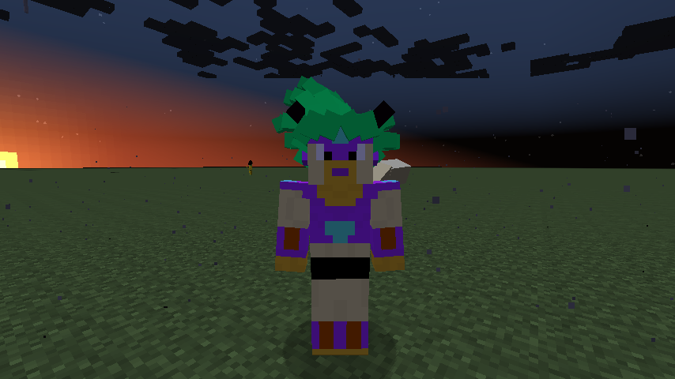

- **Race & Body Type** - Set any DBC race and body type on NPCs
- **Hair** - DBC hair styles with color control
- **Eye, Fur & Body Colors** - Full color customization for all race types
- **Arcosian Tail** - 3 tail variants with body-type color inheritance across 8 arco states
- **Gender & Age** - Female model support with proper rendering for younger models
- **DBC Armor** - Scrap armor renders correctly on NPC limbs
- **Forms, Auras & Outlines** - Assign custom forms, auras, and outlines directly to NPCs

---

### DBC Abilities

**21 ki-based ability variants** registered under the `npcdbc` namespace, integrating with the CNPC+ Ability System.

**Ki Blasts (9):** Ki Blast, Energy Blast Volley, Finish Breaker, Big Bang Attack, Burning Attack, Death Ball, Spirit Bomb, Large Spirit Bomb, Supernova
**Ki Beams (6):** Ki Wave, Kamehameha, Masenko, Galick Gun, Double Sunday, Final Flash
**Ki Lasers (2):** Special Beam Cannon, Tri-Beam
**Ki Discs (2):** Destructo Disc, Death Saucer
**Barriers (1):** Android Barrier
**Support (1):** Namekian Regeneration

Every ability ships with pre-configured animations, anchor offsets, colors, and DBC damage integration. All appear under the **"DBC Addon"** group in the variant selection GUI.

---

### DBC Toggle Abilities

**10 toggleable DBC moves** as abilities that can be switched on/off.

- **Friendly Fist**, **Swoop**, **Kaioken**, **Fusion**, **Ki Fist**, **Ki Protection**, **Ki Weapon** (Blade/Scythe), **Potential Unleashed**, **Ultra Instinct**, **God of Destruction**

Kaioken, Potential Unleashed, Ultra Instinct, and God of Destruction are mutually exclusive.

---

### DBC Damage Integration

Abilities route damage through the **DBC combat system** instead of vanilla Minecraft damage.

**Per-Ability Stats:** Release (0-100%), Friendly Fist (1-60s), Ignore Dex, Ignore Block, Ignore Endurance, Ignore Ki Protection, Ignore Form Reduction, Defense Penetration (0-100%), Dodge Chance, Lock-On targeting

**System-wide routing** for energy projectiles, barriers (with ki redirection), healing, counter/dodge/guard, and AOE/zones. A dedicated **DBC Stats tab** appears in the ability editor.

---

### DBC Conditions

**11 condition types** for controlling ability activation, registered under the `npcdbc` namespace.

**Threshold:** Ki, Stamina, Stat (STR/DEX/CON/WIL/MND/SPI)
**Identity:** Race, Class, Level
**State:** Form (active/unlocked), Fused, Locked On, DBC Effect, Skill (DBC + custom, level 0-10)

All conditions support checking the Caster, the Target, or Both.

---

### Custom Skills

Create new **learnable skills** beyond the 19 built-in DBC skills with configurable max level, TP costs, mind costs, per-player progress tracking, and ability condition integration.

---

### Status Effects

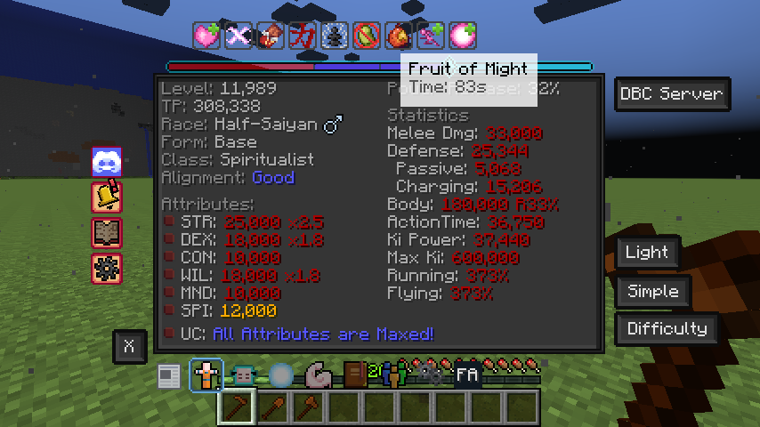

**15+ custom status effects** with configurable strength, duration, and visual icons:

- **Regeneration** - Health, Ki, and Stamina passive regen
- **Namekian Regen** - Race-specific self-healing
- **Zenkai** - Saiyan post-battle power boost (with Half-Saiyan variant)
- **Fruit of Might** - Stat boost with ki drain
- **Human Spirit** - Damage-triggered stat boost
- **Overpower** - Ki charging enhancement
- **Meditation** - Spirit boost
- **Potara Fusion** - Multi-tier fusion bonus
- **Chocolated** - Stat debuff with transform prevention
- **Exhausted** - Combat debuff
- **Bloated** - Senzu overconsumption penalty

---

### Capsules & Items

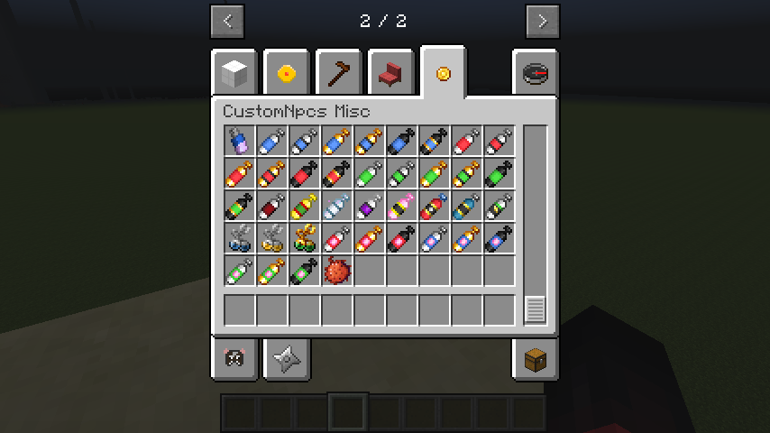

**5 capsule types** with 6 tiers each (Base, Super, Mega, Giga, Superior, Master):

- **Health Capsules** - Instant HP restoration
- **Ki Capsules** - Ki recovery
- **Stamina Capsules** - Stamina recovery
- **Regen Capsules** - Passive regeneration over time
- **Misc Capsules** - General purpose

Each tier has configurable strength, cooldown, and stack size.

---

### Potara Fusion

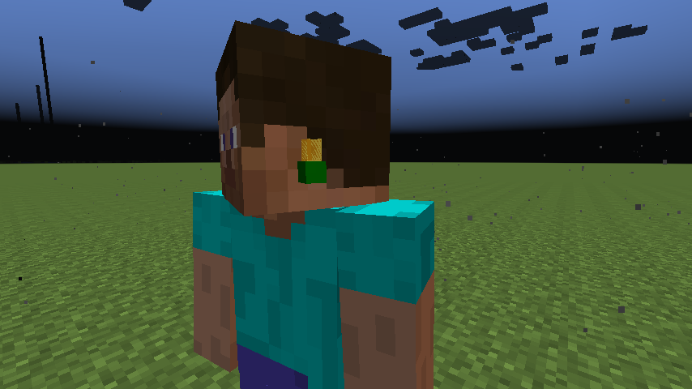

**3 fusion tiers** with unique Potara earrings. Players wearing matching earrings within range trigger fusion with tier-specific duration, stat multipliers, and effects.

---

### Enhanced Stat Sheet

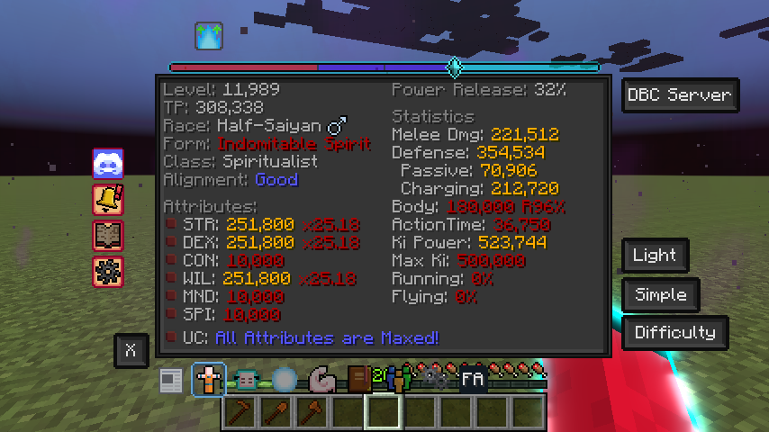

A redesigned DBC stat sheet with improved layout, animated custom effect icons, and better stat display. Supports light, simple, and difficulty view modes.

---

### Flight Improvements

Configurable flight behavior for NPCs and players:

- **Turbo Speed Modifier** - Adjustable speed multiplier for turbo flight
- **Vertical Dampening** - Upward momentum decay control
- **Enhanced Movement** - Improved flight movement model toggle

---

### Lock-On System

Overhauled client-server lock-on with entity-based targeting (35-block radius), Ki Sense requirement, sound feedback, synced state, and ability condition integration.

---

### Form Wheel

A radial selection UI for quickly switching between available forms during gameplay. Segments display form names, icons, and stat previews.

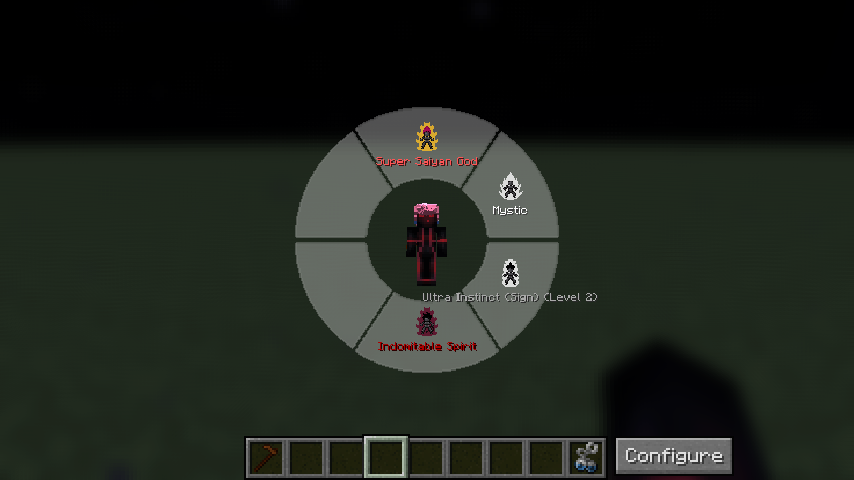

---

### Built-in Animations

Pre-packaged animations under the `npcdbc` namespace that ship with the addon:

- **Ability Animations** - All 21 ki ability variants include matching wind-up and active animations
- **Utility Animations** - Namek Regen, Fusion, Mouth Laser, Supernova
- **Multiple Registrations** - Several animations can be registered under one name for variety

---

### DBC Settings API

A scripting interface (`IDBCSettingsHandler`) for toggling DBC player settings programmatically: Fusion, Kaioken, Potential Unleashed, Ultra Instinct, God of Destruction, Friendly Fist, Swoop, Ki Protection, Ki Fist, Ki Weapon (Blade/Scythe), and Instant Transmission modes.

---

### DBC Skills Enum

A type-safe enum for all **19 DBC skills** with `tpCost()` and `mindCost()` calculation methods, replacing string-based lookups across the codebase.

---

### Energy Projectile Scripting

Full scripting for DBC energy projectiles: damage routing through the DBC pipeline, `IKiAttack` configuration interface, energy explosion API, and NBT-based damage data for all projectile types.

---

### Script Editor Integration

All DBC Addon scripting hooks are registered into the CNPC+ Script Editor with `@ParamName` annotations and autocomplete support.

**Hooks:** Form Change, DBC Damaged, Capsule Used, Senzu Used, Revived, Knockout, Skill Event

---

### TypeScript Definitions

Auto-generated `.d.ts` files covering all DBC Addon API interfaces. Patches CNPC+ types (e.g., `IPlayer.getDBCPlayer()` returns `IDBCAddon`) and enriches interface fields for syntax highlighting in the script editor.

---

### Easing Function API

Smooth interpolation curves for animations and projectile size interpolation. Supports constant, linear, piecewise linear, and cubic bezier curves with baking for performance.

---

## Scripting API

Full scripting support for all DBC Addon systems:

- **IDBCAddon** - Main addon entry point with skill, stat, and settings access
- **IForm / IFormHandler** - Form system with mastery, stacking, display, and advanced attributes
- **IAura / IAuraHandler** - Aura creation and assignment
- **IOutline / IOutlineHandler** - Outline management
- **IOverlay / IOverlayChain / IOverlayScript** - Overlay pipeline scripting
- **IDBCStats / IDBCDisplay** - NPC DBC customization
- **IDBCEffectHandler / IBonusHandler** - Effect and bonus management
- **ICustomSkill / ISkillHandler** - Custom skill system
- **IDBCAbilityStats** - Per-ability DBC combat stats
- **IDBCSettingsHandler** - Player DBC settings control
- **IKiAttack** - Ki attack configuration
- **IDBCEvent** - DBC-specific script events

**Resources:**
- Java Docs: [kamkeel.github.io/CustomNPC-DBC-Addon](https://kamkeel.github.io/CustomNPC-DBC-Addon/)

---

## Commands

| Command | Description |
|---------|-------------|
| `/kam form` | Form transformation management |
| `/kam formmastery` | Mastery level control |
| `/kam aura` | Aura assignment and management |
| `/kam outline` | Outline color and visibility |

---

## Configuration

| Config | Purpose |
|--------|---------|
| **General** | NPC display defaults, DBC stats toggle, character reset, form removal, melee resistance, hurt resistance |
| **Gameplay** | Charging mechanics, Namekian Regen, Potara fusion durations, Zenkai, Ki Charge, Human Spirit, Fruit of Might, flight/movement settings |
| **Client** | GUI modes (enhanced/dark/advanced), rendering options (HD textures, outlines, shaders, bloom), aura opacity, debug |
| **Capsules** | Per-type and per-tier capsule strength, cooldowns, and stack sizes |
| **Effects** | Duration and strength for all 15+ status effects |

---

## Building from Source

This project uses the [GTNH Gradle Convention](https://github.com/GTNewHorizons/ExampleMod1.7.10) with [RetroFuturaGradle](https://github.com/GTNewHorizons/RetroFuturaGradle).

```bash
git clone <repo-url>
git submodule update --init --recursive
./gradlew build
```

The CustomNPC+ submodule provides API sources. The build handles decompilation, compilation, mixin embedding, and `.d.ts` generation automatically.

**Run the game:**
```bash
./gradlew runClient
./gradlew runServer
```

**IDE Setup (IntelliJ):**
1. Import the project as a Gradle project
2. Run `./gradlew genIntellijRuns`
3. Add program arguments: `--tweakClass org.spongepowered.asm.launch.MixinTweaker --mixin npcdbc.mixins.json`

---
